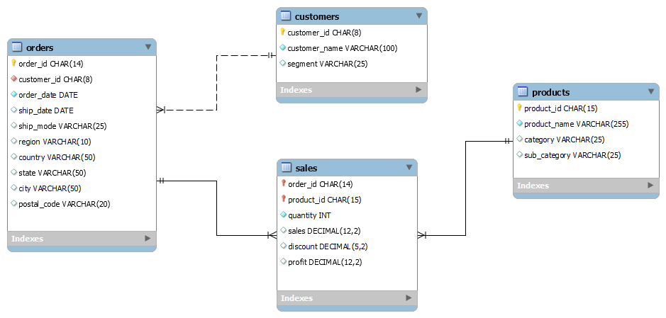

# **Superstore Data Analytics**

## About the Project
This project analyzes **sales performance, customer behavior, product trends, and operational logistics** using **SQL**. The dataset contains sales transactions from a fictional retail superstore, allowing us to extract valuable insights into **revenue trends, customer segmentation, product demand, and shipping efficiency**.

## Dataset Overview
The **Superstore dataset** consists of **9,999 rows and 21 columns**, representing transactional data. It has been **cleaned and structured** into four relational tables:

- **Customers**: Contains customer details such as **ID, name, and market segment**.
- **Orders**: Tracks **order placement details, dates, shipping, and location info**.
- **Products**: Lists **product details, categories, and subcategories**.
- **Sales**: Records **transactions, including revenue, quantity, discount, and profit**.

## Entity Relationship Diagram (ERD)
To understand the relationships between these tables, refer to the **Entity Relationship Diagram (ERD):**  


## Data Cleaning Process
Performed in **Jupyter Notebook** using **Python (pandas, NumPy)** to ensure data consistency before database creation.
✔ **Removed duplicates** & handled missing values  
✔ **Converted dates** to proper format (order_date, ship_date)  
✔ **Standardized categorical values**  
✔ **Split data** into four **normalized tables**  
📍 **Notebook Location**: [`data_cleaning.ipynb`](data_cleaning/data_cleaning.ipynb)

## Key Insights & Analysis
#### **1. _Sales Performance & Revenue_**:  Analyzed **total sales, profit trends, and discount impact**. Identified **growth patterns across months, quarters, and years** to optimize pricing and promotions.

#### **2. _Customer Behavior & Segmentation_**:  Classified customers into **high, medium, and low-value groups**. Conducted **RFM analysis** to track **purchasing habits, retention, and churn rates**.

#### **3. _Product Performance & Market Insights_**:  Identified **best and worst-selling products**, analyzed **category contributions**, and performed **market basket analysis** to uncover frequently bought-together items.

#### **4. Operational & Logistics Efficiency**:  Evaluated **shipping times, delays, and cost-effectiveness** across shipping modes. Assessed **seasonality trends** to optimize logistics and delivery performance.

## Technologies Used
✔ **SQL (MySQL)** for **data analysis**  
✔ **CTEs & Temporary Tables** for **efficient queries**  
✔ **Window Functions** (DENSE_RANK, LAG, NTILE)  
✔ **Aggregation & Joins** for **relational insights**  
✔ **Python (pandas)** for **data cleaning**  

## Project Structure
```
Superstore-Data-Analytics
│── 📁 data/               # Contains dataset files
│    ├── README.md         # Detailed dataset description
│    ├── Superstore.csv    # Raw dataset
│
│── 📁 data_cleaning/          
│    ├── data_cleaning.ipynb   # Jupyter notebooks for data cleaning
│    ├── erd_diagram.png       # ERD diagram  
│
│── 📁 queries/              # SQL scripts for analysis
│    ├── superstore_db.sql    # Creates database & tables
│    ├── analysis.sql      # SQL queries for business insights
│
│── README.md              # Project documentation (this file)
```
